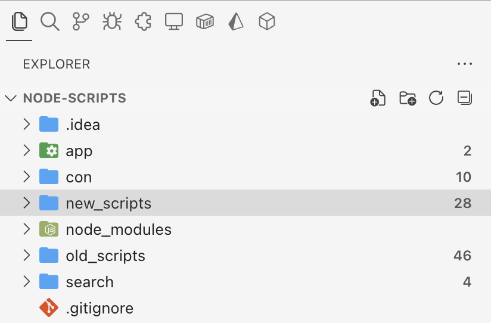
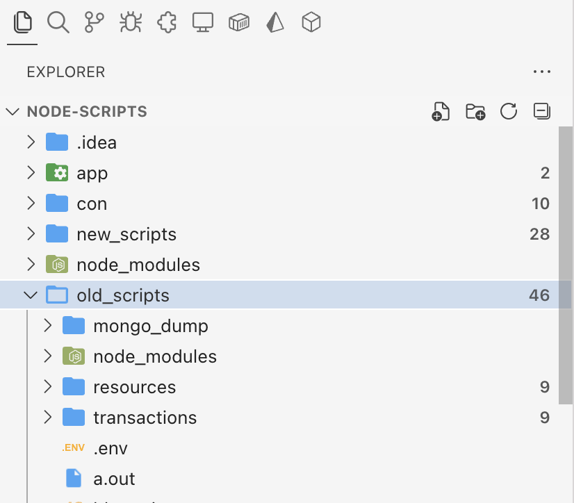

# FileCounter

A VS Code extension that displays the number of files in each folder directly in the Explorer sidebar.

## Features

- 📁 Shows file count badges next to folder names in the Explorer
- ⚙️ Configurable ignore patterns
- 🙈 Respects .gitignore files automatically
- 🔄 Real-time updates when files are added/removed
- 👁️ Toggle on/off functionality
- 🎛️ Comprehensive configuration options




## Configuration

The extension provides several configuration options that can be customized in your VS Code settings:

### `filecounter.ignorePatterns`
- **Type**: `array`
- **Default**: `[".git", ".svn", ".hg", "node_modules", "dist", "out", "build", ".vscode", ".idea", "target", "bin", "obj", "*.tmp", "*.log"]`
- **Description**: Array of glob patterns to ignore when counting files

### `filecounter.respectGitignore`
- **Type**: `boolean`
- **Default**: `true`
- **Description**: Whether to respect .gitignore files when counting files

### `filecounter.includeHiddenFiles`
- **Type**: `boolean`
- **Default**: `false`
- **Description**: Whether to include hidden files (files starting with .) in the count

### `filecounter.countSubfolders`
- **Type**: `boolean`
- **Default**: `false`
- **Description**: Whether to include files in subfolders when counting

### `filecounter.showZeroCounts`
- **Type**: `boolean`
- **Default**: `false`
- **Description**: Whether to show folders with zero files

## Commands

- **FileCounter: Refresh File Counts** - Manually refresh all file counts
- **FileCounter: Toggle File Counter** - Enable/disable the extension

## Usage

1. Install the extension
2. Open a folder in VS Code
3. File counts will automatically appear as badges next to folder names in the Explorer
4. Right-click on folders to access the refresh command
5. Use Command Palette (`Cmd+Shift+P` / `Ctrl+Shift+P`) to access toggle and refresh commands

## Customization Examples

### Custom Ignore Patterns
```json
{
  "filecounter.ignorePatterns": [
    ".git",
    "node_modules",
    "*.log",
    "temp/*",
    "cache/**"
  ]
}
```

### Include Hidden Files and Subfolders
```json
{
  "filecounter.includeHiddenFiles": true,
  "filecounter.countSubfolders": true
}
```

### Disable Gitignore Respect
```json
{
  "filecounter.respectGitignore": false
}
```

## Requirements

- VS Code 1.102.0 or higher

## Known Issues

- File counts are cached for performance; use the refresh command if counts seem outdated
- Very large directories may take a moment to calculate counts

## Release Notes

### 0.0.1

Initial release of FileCounter with:
- Basic file counting functionality
- Configurable ignore patterns
- Gitignore file support
- Real-time updates
- Toggle and refresh commands

---

**Enjoy!**
